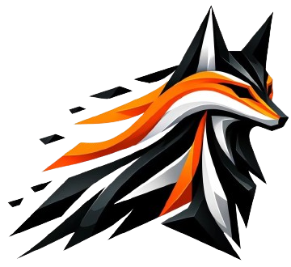
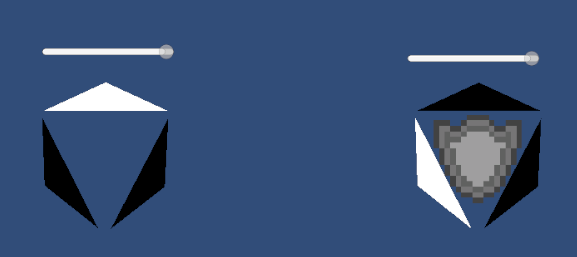
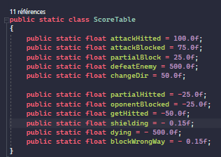
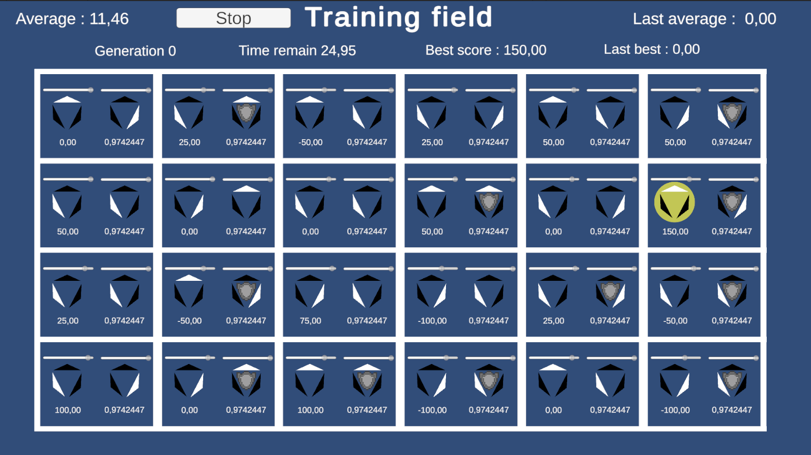
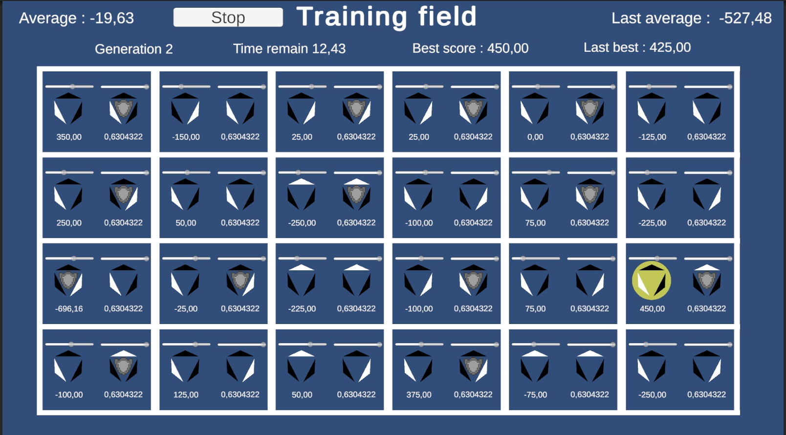
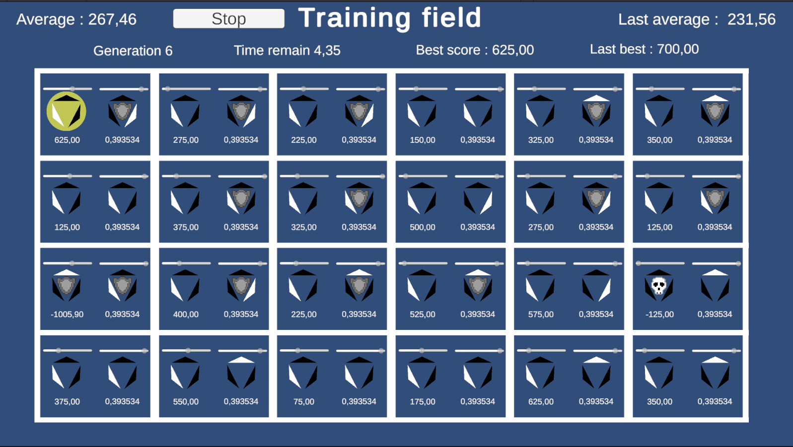

# Ai learning

Le but de ce projet est de comprendre les réseaux neuronaux et leurs apprentissage.

## Etape 1 : Création d'une librairie 

Cette étape fus l'étape la plus longue, et pour cause j'avais l'envie de créer de A a Z une librairie fonctionnelle permettant de créer et manipuler facilement les réseaux de neurones. 

J'ai ainsi donc créer brainFoxCS, avec cette ambition et avec pour projet d'en faire une version C++ a terme.

[Lien vers le repo github](https://github.com/Elmea/BrainFox/tree/master)
(Logo généré par IA générative)

J'ai utilisé le C# pour cette première version afin de pouvoir rapidement faire des tests avec Unity.

## Etape 2 : Algorhitme d'apprentissage

Une fois ma librairie créée, beaucoup de problème sont apparu, notament avec la backpropagation dont j'ai encore du mal a régler les bugs. 

Ayant que peu de temps pour réaliser se projet, je me suis penchée sur d'autre méthodes d'apprentissage et ayant auparavent entendu parlé des algorithme génétiques, je me suis interessée au sujet.

J'ai alors choisis l'algorithme NEAT pour mon projet, ce qui impliquais donc l'ajout de nouvelles fonctions : Une de "*reproduction*" et une seconde de "*mutation*". 

### L'algorhitme NEAT :

NEAT, pour *NeuroEvolution of Augmenting Topologies*, est un algorithme d'apprentissage se basant sur les théories de l'évolution de Charles Robert Darwin. 

Pour le mettre en pratiques, on créé une population importante d'IA avec des résaux neuronaux plus ou moins aléatoire, puis on les laisses évoluer en leurs attribuant un score en fonction de leurs actions.

(Exemple de l'aire d'entrainement de mon projet d'application)

Une fois que la génération N a terminé d'évoluer, on garde les IA avec les meilleurs scores et ont créé la génération N+1 a partir d'elles. On les fais se "reproduire" en donnant au réseaux neuronnal enfant, la moitié de la structure du parent A, et l'autre moitié de la structure du parent B. 

Ensuite on fais "muter" le réseau neuronals "enfant" en le soumettant a des mutations aléatoire tel que l'ajout ou la suppression de neuronne ou encore la perturbation de poids de connections entre ces derniers.

On réitère ensuite jusqu'a atteindre un résultat satisfaisant. 

## Etape 3 : L'application

Pour appliquer ces compétences fraichement acquise, j'avais en tête de mettre en place des "duel de chevalier" prenant comme inspiration le système de combats par direction de *For Honnor* créé par Ubisoft. 

Ainsi j'ai mis en place un système reprenant ces bases maisen les simplifiants au maximum

Ainsi donc le "joueur" est représenté par un ensemble de 3 flèches, la blanche représentant la direction qu'il selectionne pour se protéger ou porter une attaque. 

A partir de la, il peut se protéger pour bloquer complètement une attaque venant de la direction selectionnée, ou porter une attaque qui s'effectuera avec un petit délai, laissant a son oposant le temps de réagir. 

### L'entrainement :

Pour entrainer les IA, j'ai d'abord décider de les faire s'affronter entre elles, créant une sorte de grand tournois de duel ou les meilleurs combatant sont selectionné pour créer la génération de combatant suivante. 

Ainsi, voici la table de score utilisée durant le projet :

Les IA avait au début tendance a se bloquer dans une position de protection, j'ai donc ajouter une pénalité pour se protéger trop longtemps.

Cependant cette première idée avait ces failles et les ia n'apprenait par réellement et, meme apres une trentaine de génération, avait toujours un comportement aléatoire. 

J'ai donc mis en place une nouvelle scène d'entrainement :

Plus complète, cette nouvelle scène oppose chaque combatant a un manequin d'entrainement quichange aléatoirement de position toute les 5 secondes. Mon but était de rendre l'IA plus réactive face aux changement de positions de son adversaire.

On peux observer sur ce comparatif qu'il y a une progression significative des scores moyens d'une génération a l'autre, prouvant que l'IA apprend correctement.

Cependant l'IA semble toujours assez insensible aux positions de l'adversaire et reste, apres plusieurs génération, sur une stratégie tres simple, choisir une direction puis l'attaquer en boucle pour marquer des points.

## Amélioration a apporter :

- Pour améliorer mon modèle, il me faudrais trouver une meilleurs combinaisons pour ma table de score, et trouver une méthode permettant de priviligier les IA changeant régulièrement de posture.

- Régler les bugs de la backpropagation pour la librairie

## Post scriptum

Apres rendu je me suis de nouveau penchée sur le sujet, il savère que mes IA ne prenait pas de concrète décision car je générais un NN aléatoirement pour chacune a la génération 0. En leurs donnant un NN vide avec des connections aléatoire, j'obtient un résultat beaucoup plus intéressant (Voir push post rendu)